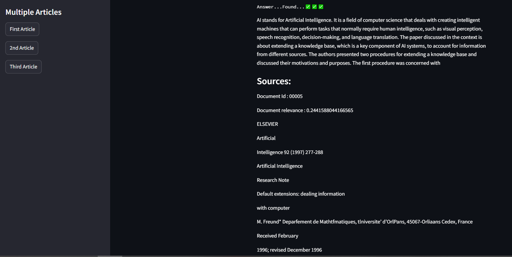

# BeSearcher

This project  is a hobby of mine that I thought it comes handy in the future for me . technically what it dose is searching for answer to my questions through research papers and its like a bot . get it ? nvm :( 

## Development

It hasn't been finished yet  , it's a big project but the first functional part of it is completed and there are pictures of the demmo app running in my google colab . 

asking questions           |  getting the answer 
:-------------------------:|:-------------------------:
  |  

It's going to be perfect when I'm done with it .

